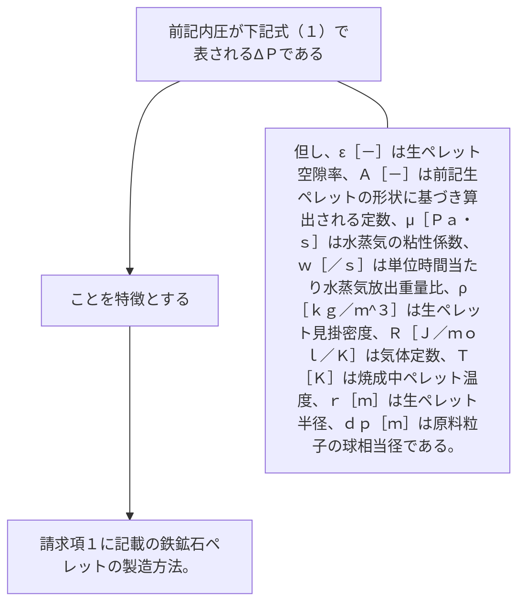

```mermaid
flowchart TD
A[前記内圧が下記式（１）で表されるΔＰである]
B[ことを特徴とする]
C[請求項１に記載の鉄鉱石ペレットの製造方法。]
D[但し、ε［－］は生ペレット空隙率、Ａ［－］は前記生ペレットの形状に基づき算出される定数、μ［Ｐａ・ｓ］は水蒸気の粘性係数、ｗ［／ｓ］は単位時間当たり水蒸気放出重量比、ρ［ｋｇ／ｍ^３］は生ペレット見掛密度、Ｒ［Ｊ／ｍｏｌ／Ｋ］は気体定数、Ｔ［Ｋ］は焼成中ペレット温度、ｒ［ｍ］は生ペレット半径、ｄｐ［ｍ］は原料粒子の球相当径である。]

A --> B
B --> C
A --- D
```