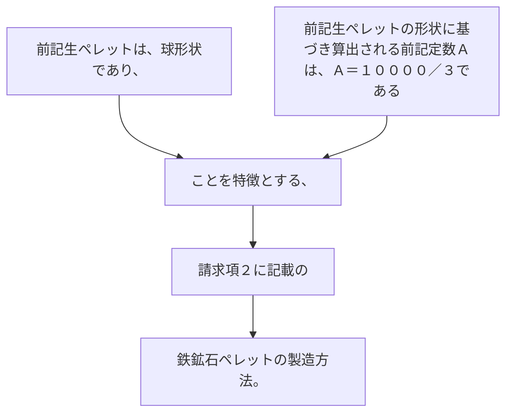

前記生ペレットは、球形状であり、
前記生ペレットの形状に基づき算出される前記定数Ａは、Ａ＝１００００／３であることを特徴とする、請求項２に記載の鉄鉱石ペレットの製造方法。

```mermaid
flowchart TD
A[前記生ペレットは、球形状であり、]
B[前記生ペレットの形状に基づき算出される前記定数Ａは、Ａ＝１００００／３である]
C[ことを特徴とする、]
D[請求項２に記載の]
E[鉄鉱石ペレットの製造方法。]
A --> C
B --> C
C --> D
D --> E
```