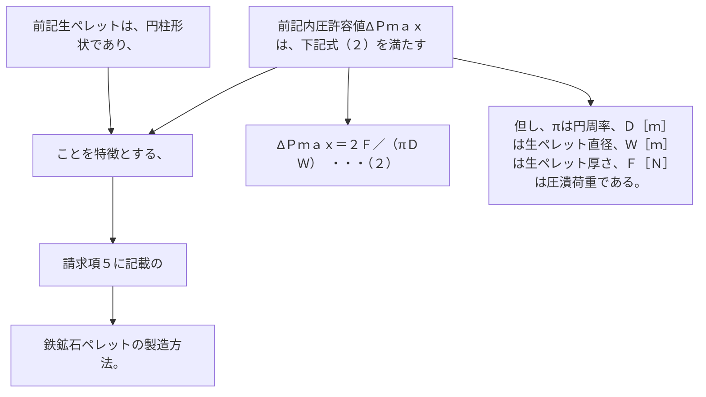

```mermaid
flowchart TD
A[前記生ペレットは、円柱形状であり、]
B[前記内圧許容値ΔＰｍａｘは、下記式（２）を満たす]
C[ことを特徴とする、]
D[請求項５に記載の]
E[鉄鉱石ペレットの製造方法。]
F[ΔＰｍａｘ＝２Ｆ／（πＤＷ）  ・・・（２）]
G[但し、πは円周率、Ｄ［ｍ］は生ペレット直径、Ｗ［ｍ］は生ペレット厚さ、Ｆ［Ｎ］は圧潰荷重である。]

A --> C
B --> C
B --> F
B --> G
C --> D
D --> E
```