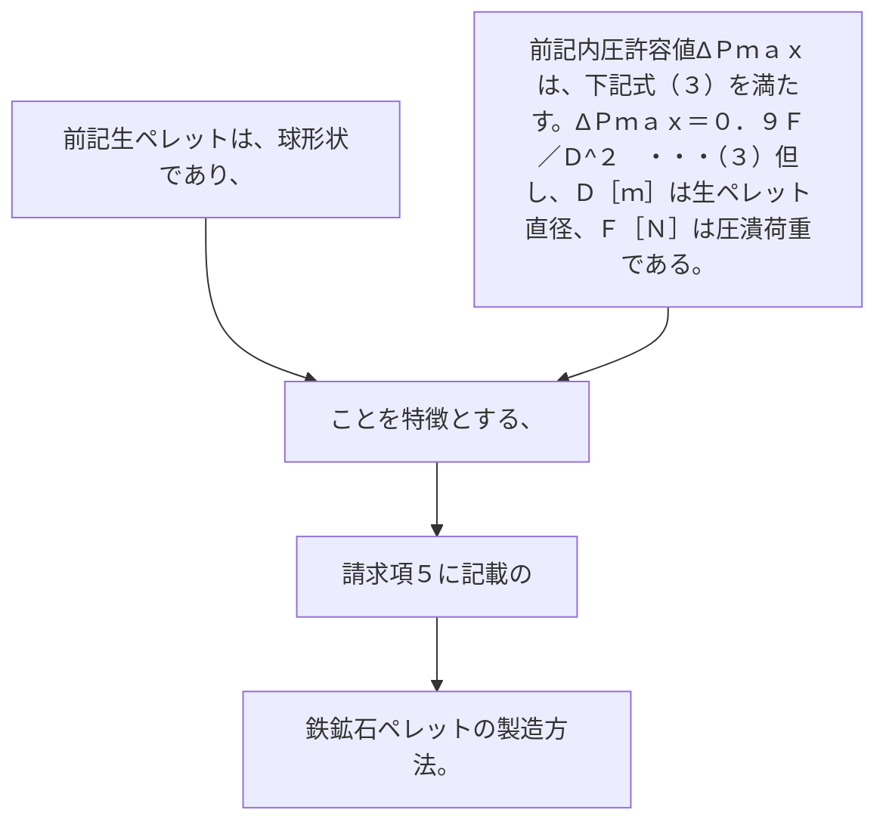

```mermaid
flowchart TD
A[前記生ペレットは、球形状であり、]
B[前記内圧許容値ΔＰｍａｘは、下記式（３）を満たす。ΔＰｍａｘ＝０．９Ｆ／Ｄ^２　・・・（３）但し、Ｄ［ｍ］は生ペレット直径、Ｆ［Ｎ］は圧潰荷重である。]
C[ことを特徴とする、]
D[請求項５に記載の]
E[鉄鉱石ペレットの製造方法。]
A --> C
B --> C
C --> D
D --> E
```