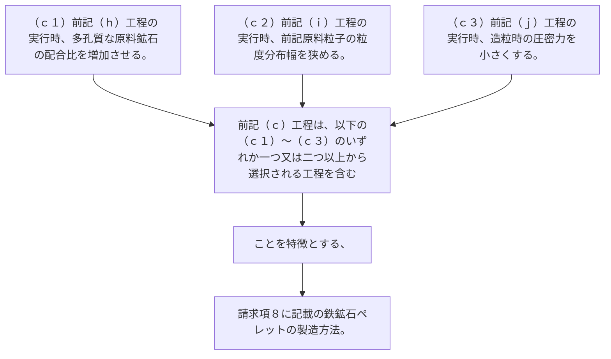

```mermaid
flowchart TD
A[前記（ｃ）工程は、以下の（ｃ１）～（ｃ３）のいずれか一つ又は二つ以上から選択される工程を含む]
B[ことを特徴とする、]
C[請求項８に記載の鉄鉱石ペレットの製造方法。]
D[（ｃ１）前記（ｈ）工程の実行時、多孔質な原料鉱石の配合比を増加させる。]
E[（ｃ２）前記（ｉ）工程の実行時、前記原料粒子の粒度分布幅を狭める。]
F[（ｃ３）前記（ｊ）工程の実行時、造粒時の圧密力を小さくする。]

D --> A
E --> A
F --> A
A --> B
B --> C
```