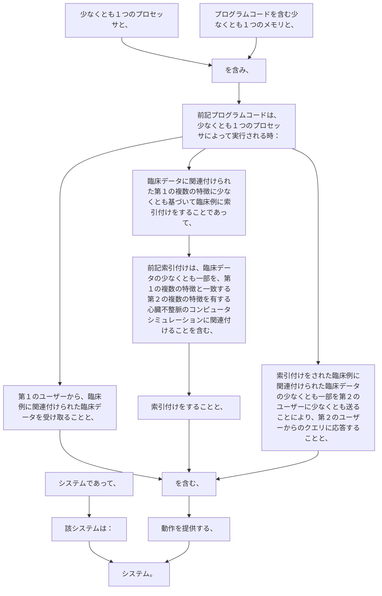

システムであって、該システムは：
少なくとも１つのプロセッサと、
プログラムコードを含む少なくとも１つのメモリと、を含み、前記プログラムコードは、少なくとも１つのプロセッサによって実行される時：
第１のユーザーから、臨床例に関連付けられた臨床データを受け取ることと、
臨床データに関連付けられた第１の複数の特徴に少なくとも基づいて臨床例に索引付けをすることであって、前記索引付けは、臨床データの少なくとも一部を、第１の複数の特徴と一致する第２の複数の特徴を有する心臓不整脈のコンピュータシミュレーションに関連付けることを含む、索引付けをすることと、
索引付けをされた臨床例に関連付けられた臨床データの少なくとも一部を第２のユーザーに少なくとも送ることにより、第２のユーザーからのクエリに応答することと、を含む、動作を提供する、システム。
