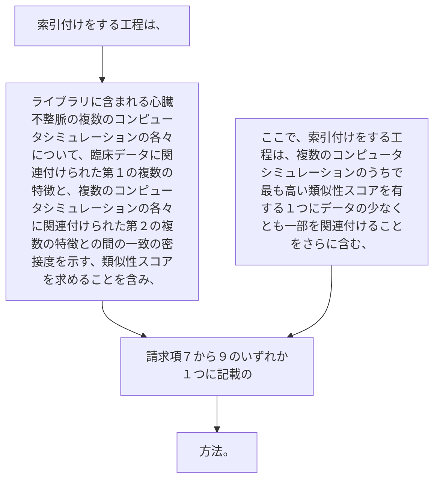

索引付けをする工程は、ライブラリに含まれる心臓不整脈の複数のコンピュータシミュレーションの各々について、臨床データに関連付けられた第１の複数の特徴と、複数のコンピュータシミュレーションの各々に関連付けられた第２の複数の特徴との間の一致の密接度を示す、類似性スコアを求めることを含み、ここで、索引付けをする工程は、複数のコンピュータシミュレーションのうちで最も高い類似性スコアを有する１つにデータの少なくとも一部を関連付けることをさらに含む、請求項７から９のいずれか１つに記載の方法。
