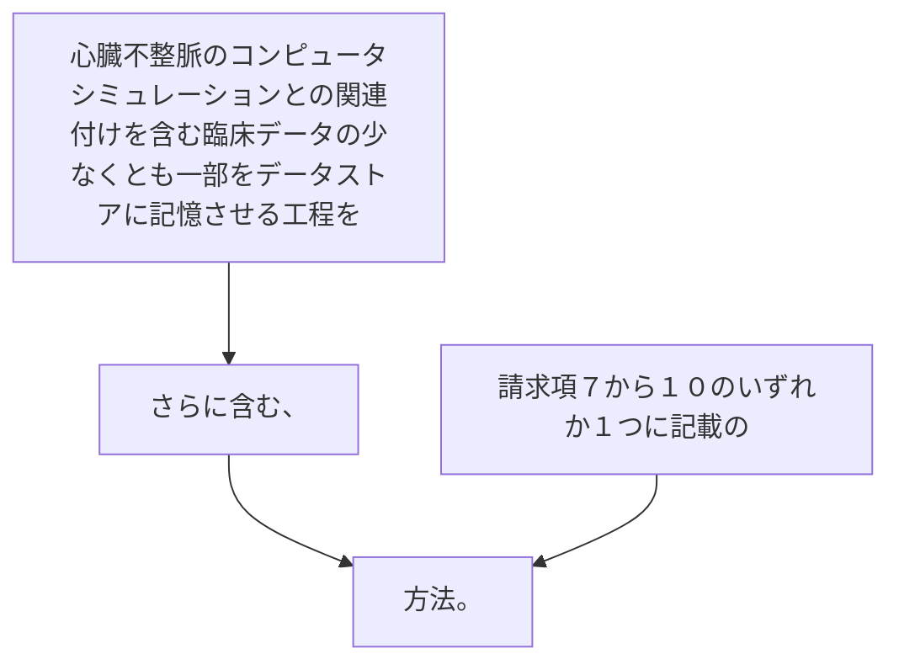

心臓不整脈のコンピュータシミュレーションとの関連付けを含む臨床データの少なくとも一部をデータストアに記憶させる工程をさらに含む、請求項７から１０のいずれか１つに記載の方法。

```mermaid
flowchart TD
A[心臓不整脈のコンピュータシミュレーションとの関連付けを含む臨床データの少なくとも一部をデータストアに記憶させる工程を]
B[さらに含む、]
C[請求項７から１０のいずれか１つに記載の]
D[方法。]

A --> B
B --> D
C --> D
```