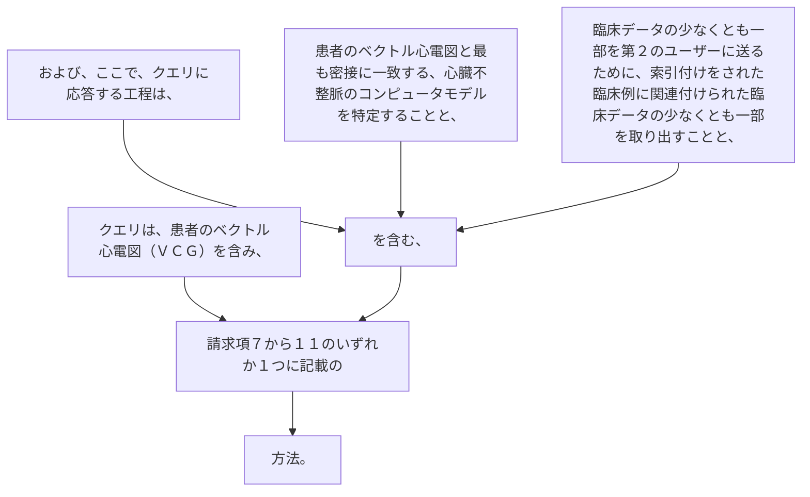

```mermaid
flowchart TD
A[クエリは、患者のベクトル心電図（ＶＣＧ）を含み、]
B[および、ここで、クエリに応答する工程は、]
C[患者のベクトル心電図と最も密接に一致する、心臓不整脈のコンピュータモデルを特定することと、]
D[臨床データの少なくとも一部を第２のユーザーに送るために、索引付けをされた臨床例に関連付けられた臨床データの少なくとも一部を取り出すことと、]
E[を含む、]
F[請求項７から１１のいずれか１つに記載の]
G[方法。]
A --> F
B --> E
C --> E
D --> E
E --> F
F --> G
```