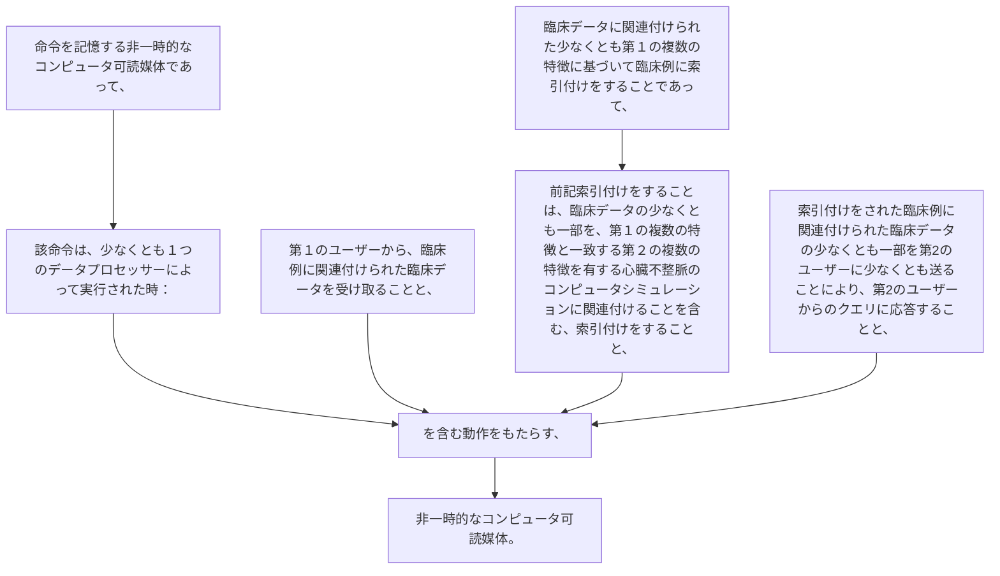

命令を記憶する非一時的なコンピュータ可読媒体であって、該命令は、少なくとも１つのデータプロセッサーによって実行された時：
第１のユーザーから、臨床例に関連付けられた臨床データを受け取ることと、
臨床データに関連付けられた少なくとも第１の複数の特徴に基づいて臨床例に索引付けをすることであって、前記索引付けをすることは、臨床データの少なくとも一部を、第１の複数の特徴と一致する第２の複数の特徴を有する心臓不整脈のコンピュータシミュレーションに関連付けることを含む、索引付けをすることと、
索引付けをされた臨床例に関連付けられた臨床データの少なくとも一部を第２のユーザーに少なくとも送ることにより、第２のユーザーからのクエリに応答することと、を含む動作をもたらす、非一時的なコンピュータ可読媒体。
