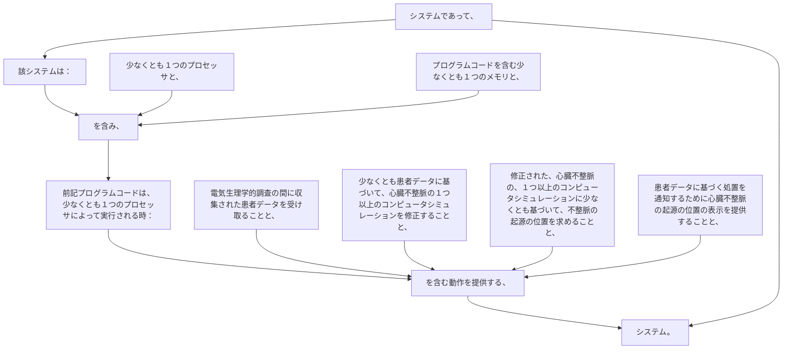

システムであって、該システムは：
少なくとも１つのプロセッサと、
プログラムコードを含む少なくとも１つのメモリと、を含み、前記プログラムコードは、少なくとも１つのプロセッサによって実行される時：
電気生理学的調査の間に収集された患者データを受け取ることと、
少なくとも患者データに基づいて、心臓不整脈の１つ以上のコンピュータシミュレーションを修正することと、
修正された、心臓不整脈の、１つ以上のコンピュータシミュレーションに少なくとも基づいて、不整脈の起源の位置を求めることと、
患者データに基づく処置を通知するために心臓不整脈の起源の位置の表示を提供することと、を含む動作を提供する、システム。
