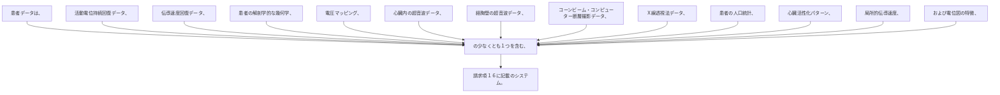

```mermaid
flowchart TD
A[患者データは、]
B[活動電位持続回復データ、]
C[伝導速度回復データ、]
D[患者の解剖学的な幾何学、]
E[電圧マッピング、]
F[心臓内の超音波データ、]
G[経胸壁の超音波データ、]
H[コーンビーム・コンピューター断層撮影データ、]
I[Ｘ線透視法データ、]
J[患者の人口統計、]
K[心臓活性化パターン、]
L[局所的伝導速度、]
M[および電位図の特徴、]
N[の少なくとも１つを含む、]
O[請求項１６に記載のシステム。]
A --> N
B --> N
C --> N
D --> N
E --> N
F --> N
G --> N
H --> N
I --> N
J --> N
K --> N
L --> N
M --> N
N --> O
```