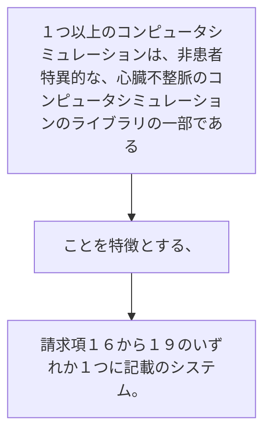

１つ以上のコンピュータシミュレーションは、非患者特異的な、心臓不整脈のコンピュータシミュレーションのライブラリの一部であることを特徴とする、請求項１６から１９のいずれか１つに記載のシステム。

```mermaid
flowchart TD
A[１つ以上のコンピュータシミュレーションは、非患者特異的な、心臓不整脈のコンピュータシミュレーションのライブラリの一部である]
B[ことを特徴とする、]
C[請求項１６から１９のいずれか１つに記載のシステム。]
A --> B
B --> C
```