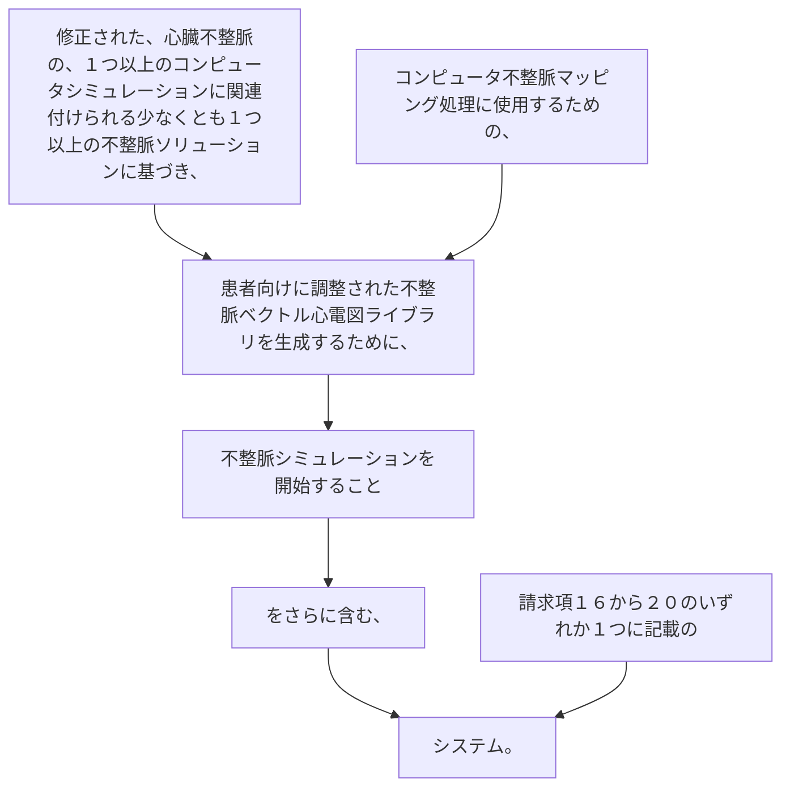

```mermaid
flowchart TD
A[修正された、心臓不整脈の、１つ以上のコンピュータシミュレーションに関連付けられる少なくとも１つ以上の不整脈ソリューションに基づき、]
B[コンピュータ不整脈マッピング処理に使用するための、]
C[患者向けに調整された不整脈ベクトル心電図ライブラリを生成するために、]
D[不整脈シミュレーションを開始すること]
E[をさらに含む、]
F[請求項１６から２０のいずれか１つに記載の]
G[システム。]

A --> C
B --> C
C --> D
D --> E
E --> G
F --> G
```