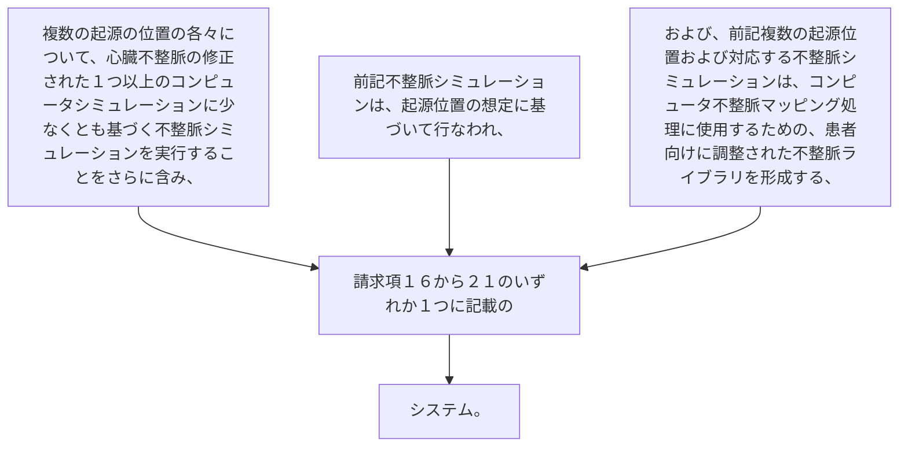

```mermaid
flowchart TD
A[複数の起源の位置の各々について、心臓不整脈の修正された１つ以上のコンピュータシミュレーションに少なくとも基づく不整脈シミュレーションを実行することをさらに含み、]
B[前記不整脈シミュレーションは、起源位置の想定に基づいて行なわれ、]
C[および、前記複数の起源位置および対応する不整脈シミュレーションは、コンピュータ不整脈マッピング処理に使用するための、患者向けに調整された不整脈ライブラリを形成する、]
D[請求項１６から２１のいずれか１つに記載の]
E[システム。]
A --> D
B --> D
C --> D
D --> E
```