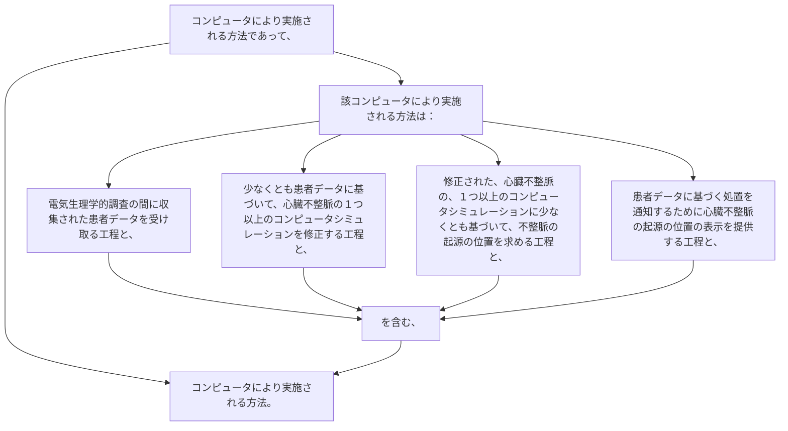

```mermaid
flowchart TD
A[コンピュータにより実施される方法であって、]
B[該コンピュータにより実施される方法は：]
C[電気生理学的調査の間に収集された患者データを受け取る工程と、]
D[少なくとも患者データに基づいて、心臓不整脈の１つ以上のコンピュータシミュレーションを修正する工程と、]
E[修正された、心臓不整脈の、１つ以上のコンピュータシミュレーションに少なくとも基づいて、不整脈の起源の位置を求める工程と、]
F[患者データに基づく処置を通知するために心臓不整脈の起源の位置の表示を提供する工程と、]
G[を含む、]
H[コンピュータにより実施される方法。]
A --> H
A --> B
B --> C
B --> D
B --> E
B --> F
C --> G
D --> G
E --> G
F --> G
G --> H
```