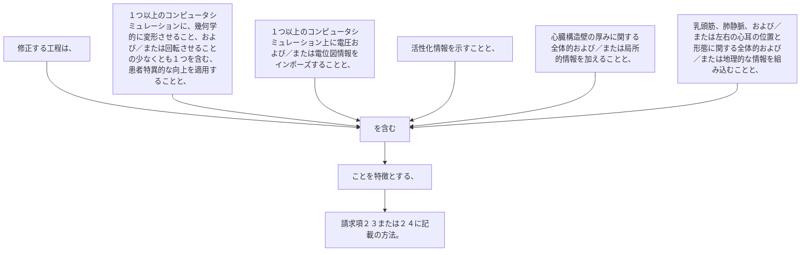

```mermaid
flowchart TD
A[修正する工程は、]
B[１つ以上のコンピュータシミュレーションに、幾何学的に変形させること、および／または回転させることの少なくとも１つを含む、患者特異的な向上を適用することと、]
C[１つ以上のコンピュータシミュレーション上に電圧および／または電位図情報をインポーズすることと、]
D[活性化情報を示すことと、]
E[心臓構造壁の厚みに関する全体的および／または局所的情報を加えることと、]
F[乳頭筋、肺静脈、および／または左右の心耳の位置と形態に関する全体的および／または地理的な情報を組み込むことと、]
G[を含む]
H[ことを特徴とする、]
I[請求項２３または２４に記載の方法。]
A --> G
B --> G
C --> G
D --> G
E --> G
F --> G
G --> H
H --> I
```