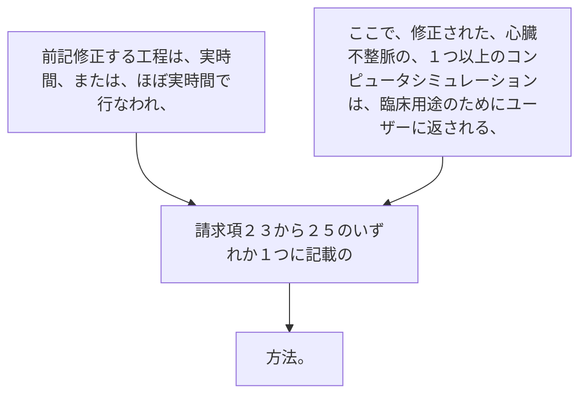

前記修正する工程は、実時間、または、ほぼ実時間で行なわれ、ここで、修正された、心臓不整脈の、１つ以上のコンピュータシミュレーションは、臨床用途のためにユーザーに返される、請求項２３から２５のいずれか１つに記載の方法。

```mermaid
flowchart TD
A[前記修正する工程は、実時間、または、ほぼ実時間で行なわれ、]
B[ここで、修正された、心臓不整脈の、１つ以上のコンピュータシミュレーションは、臨床用途のためにユーザーに返される、]
C[請求項２３から２５のいずれか１つに記載の]
D[方法。]
A --> C
B --> C
C --> D
```