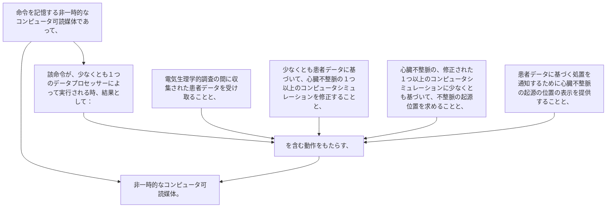

命令を記憶する非一時的なコンピュータ可読媒体であって、該命令が、少なくとも１つのデータプロセッサーによって実行される時、結果として：
電気生理学的調査の間に収集された患者データを受け取ることと、
少なくとも患者データに基づいて、心臓不整脈の１つ以上のコンピュータシミュレーションを修正することと、
心臓不整脈の、修正された１つ以上のコンピュータシミュレーションに少なくとも基づいて、不整脈の起源位置を求めることと、
患者データに基づく処置を通知するために心臓不整脈の起源の位置の表示を提供することと、を含む動作をもたらす、非一時的なコンピュータ可読媒体。
