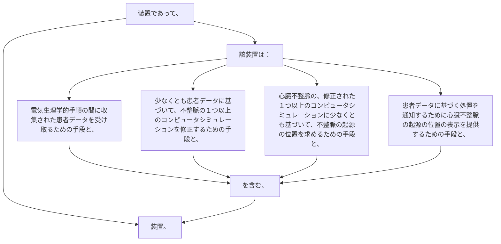

装置であって、該装置は：
電気生理学的手順の間に収集された患者データを受け取るための手段と、
少なくとも患者データに基づいて、不整脈の１つ以上のコンピュータシミュレーションを修正するための手段と、
心臓不整脈の、修正された１つ以上のコンピュータシミュレーションに少なくとも基づいて、不整脈の起源の位置を求めるための手段と、
患者データに基づく処置を通知するために心臓不整脈の起源の位置の表示を提供するための手段と、を含む、装置。
