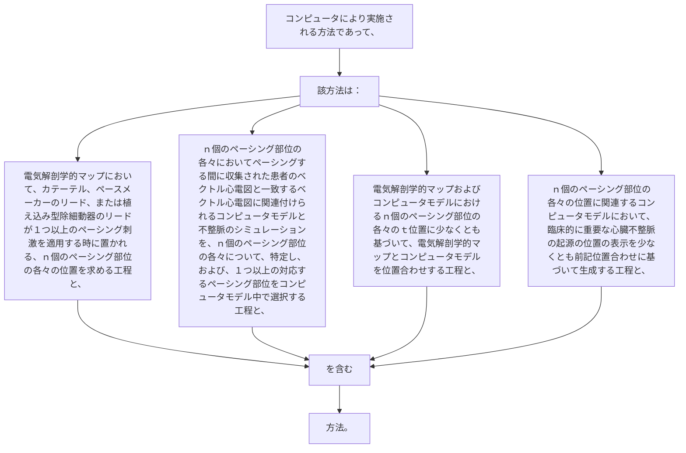

コンピュータにより実施される方法であって、該方法は：
電気解剖学的マップにおいて、カテーテル、ペースメーカーのリード、または植え込み型除細動器のリードが１つ以上のペーシング刺激を適用する時に置かれる、ｎ個のペーシング部位の各々の位置を求める工程と、
ｎ個のペーシング部位の各々においてペーシングする間に収集された患者のベクトル心電図と一致するベクトル心電図に関連付けられるコンピュータモデルと不整脈のシミュレーションを、ｎ個のペーシング部位の各々について、特定し、および、１つ以上の対応するペーシング部位をコンピュータモデル中で選択する工程と、
電気解剖学的マップおよびコンピュータモデルにおけるｎ個のペーシング部位の各々のｔ位置に少なくとも基づいて、電気解剖学的マップとコンピュータモデルを位置合わせする工程と、
ｎ個のペーシング部位の各々の位置に関連するコンピュータモデルにおいて、臨床的に重要な心臓不整脈の起源の位置の表示を少なくとも前記位置合わせに基づいて生成する工程と、を含む方法。
