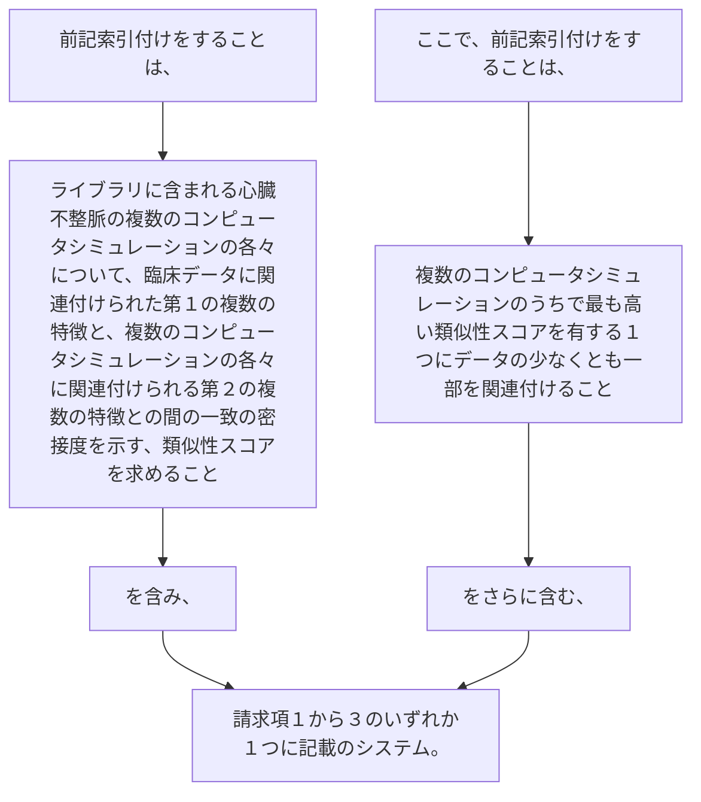

```mermaid
flowchart TD
A[前記索引付けをすることは、]
B[ライブラリに含まれる心臓不整脈の複数のコンピュータシミュレーションの各々について、臨床データに関連付けられた第１の複数の特徴と、複数のコンピュータシミュレーションの各々に関連付けられる第２の複数の特徴との間の一致の密接度を示す、類似性スコアを求めること]
C[を含み、]
D[ここで、前記索引付けをすることは、]
E[複数のコンピュータシミュレーションのうちで最も高い類似性スコアを有する１つにデータの少なくとも一部を関連付けること]
F[をさらに含む、]
G[請求項１から３のいずれか１つに記載のシステム。]

A --> B
B --> C
D --> E
E --> F
C --> G
F --> G
```