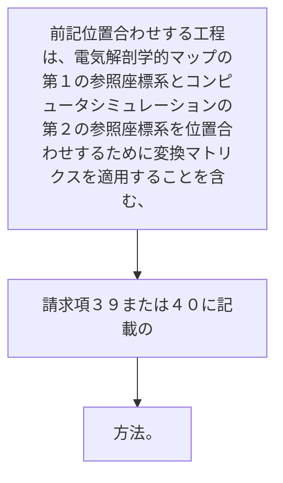

前記位置合わせする工程は、電気解剖学的マップの第１の参照座標系とコンピュータシミュレーションの第２の参照座標系を位置合わせするために変換マトリクスを適用することを含む、請求項３９または４０に記載の方法。

```mermaid
flowchart TD
A[前記位置合わせする工程は、電気解剖学的マップの第１の参照座標系とコンピュータシミュレーションの第２の参照座標系を位置合わせするために変換マトリクスを適用することを含む、]
B[請求項３９または４０に記載の]
C[方法。]
A --> B
B --> C
```