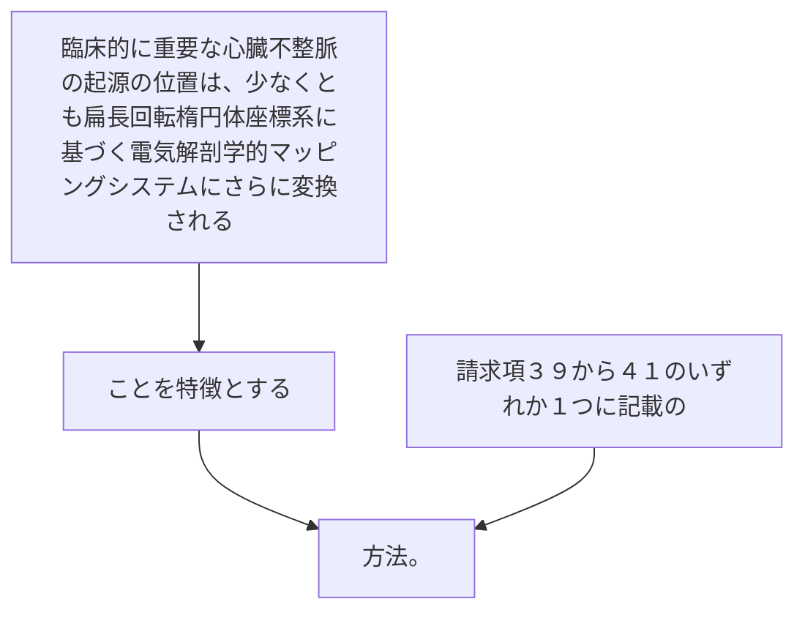

臨床的に重要な心臓不整脈の起源の位置は、少なくとも扁長回転楕円体座標系に基づく電気解剖学的マッピングシステムにさらに変換されることを特徴とする、請求項３９から４１のいずれか１つに記載の方法。

```mermaid
flowchart TD
A[臨床的に重要な心臓不整脈の起源の位置は、少なくとも扁長回転楕円体座標系に基づく電気解剖学的マッピングシステムにさらに変換される]
B[ことを特徴とする]
C[請求項３９から４１のいずれか１つに記載の]
D[方法。]
A --> B
B --> D
C --> D
```