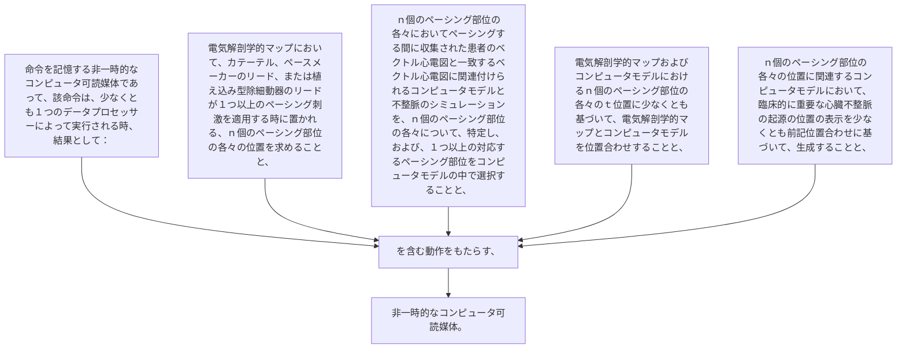

命令を記憶する非一時的なコンピュータ可読媒体であって、該命令は、少なくとも１つのデータプロセッサーによって実行される時、結果として：
電気解剖学的マップにおいて、カテーテル、ペースメーカーのリード、または植え込み型除細動器のリードが１つ以上のペーシング刺激を適用する時に置かれる、ｎ個のペーシング部位の各々の位置を求めることと、
ｎ個のペーシング部位の各々においてペーシングする間に収集された患者のベクトル心電図と一致するベクトル心電図に関連付けられるコンピュータモデルと不整脈のシミュレーションを、ｎ個のペーシング部位の各々について、特定し、および、１つ以上の対応するペーシング部位をコンピュータモデルの中で選択することと、
電気解剖学的マップおよびコンピュータモデルにおけるｎ個のペーシング部位の各々のｔ位置に少なくとも基づいて、電気解剖学的マップとコンピュータモデルを位置合わせすることと、
ｎ個のペーシング部位の各々の位置に関連するコンピュータモデルにおいて、臨床的に重要な心臓不整脈の起源の位置の表示を少なくとも前記位置合わせに基づいて、生成することと、を含む動作をもたらす、非一時的なコンピュータ可読媒体。
