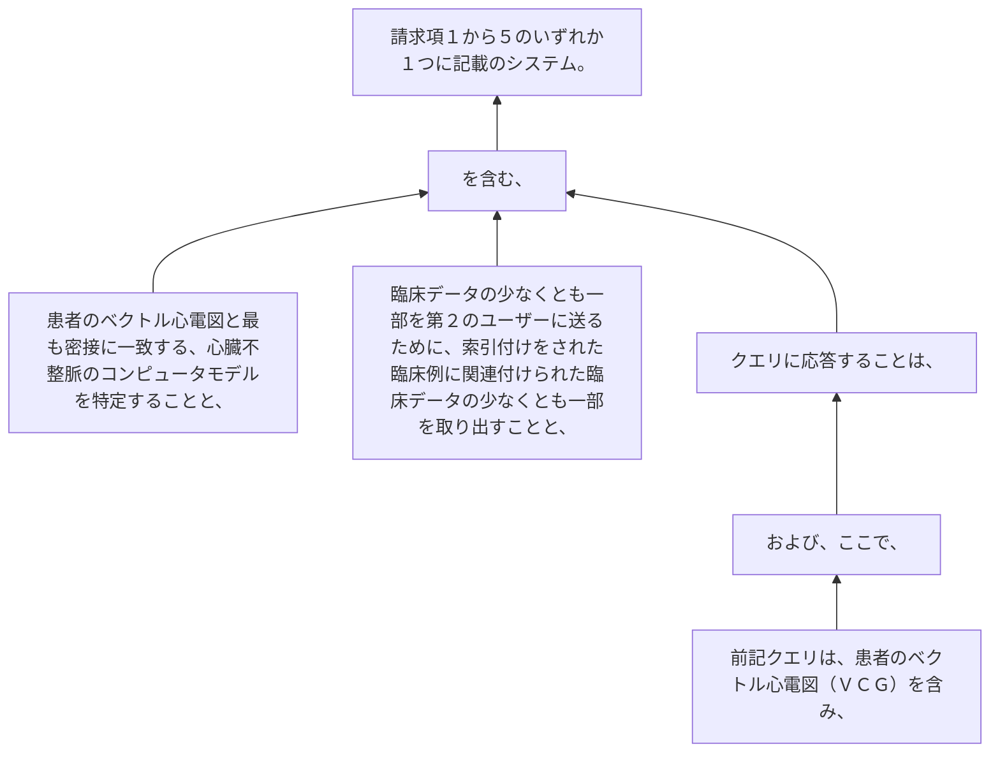

前記クエリは、患者のベクトル心電図（ＶＣＧ）を含み、および、ここで、クエリに応答することは、患者のベクトル心電図と最も密接に一致する、心臓不整脈のコンピュータモデルを特定することと、臨床データの少なくとも一部を第２のユーザーに送るために、索引付けをされた臨床例に関連付けられた臨床データの少なくとも一部を取り出すことと、を含む、請求項１から５のいずれか１つに記載のシステム。

```mermaid
flowchart BT
A[前記クエリは、患者のベクトル心電図（ＶＣＧ）を含み、]
B[および、ここで、]
C[クエリに応答することは、]
D[患者のベクトル心電図と最も密接に一致する、心臓不整脈のコンピュータモデルを特定することと、]
E[臨床データの少なくとも一部を第２のユーザーに送るために、索引付けをされた臨床例に関連付けられた臨床データの少なくとも一部を取り出すことと、]
F[を含む、]
G[請求項１から５のいずれか１つに記載のシステム。]
A --> B
B --> C
D --> F
E --> F
C --> F
F --> G
```