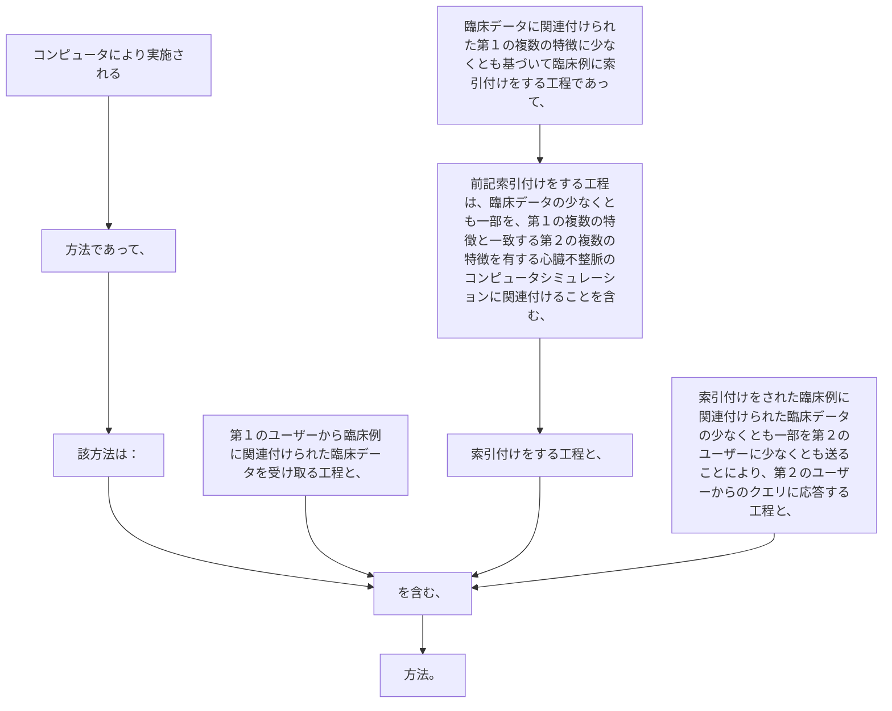

```mermaid
flowchart TD
A[コンピュータにより実施される]
B[方法であって、]
C[該方法は：]
D[第１のユーザーから臨床例に関連付けられた臨床データを受け取る工程と、]
E[臨床データに関連付けられた第１の複数の特徴に少なくとも基づいて臨床例に索引付けをする工程であって、]
F[前記索引付けをする工程は、臨床データの少なくとも一部を、第１の複数の特徴と一致する第２の複数の特徴を有する心臓不整脈のコンピュータシミュレーションに関連付けることを含む、]
G[索引付けをする工程と、]
H[索引付けをされた臨床例に関連付けられた臨床データの少なくとも一部を第２のユーザーに少なくとも送ることにより、第２のユーザーからのクエリに応答する工程と、]
I[を含む、]
J[方法。]
A --> B
B --> C
C --> I
D --> I
E --> F
F --> G
G --> I
H --> I
I --> J
```