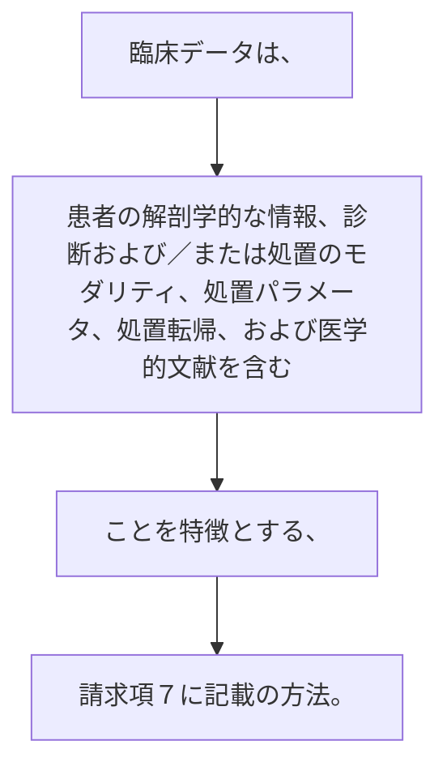

臨床データは、患者の解剖学的な情報、診断および／または処置のモダリティ、処置パラメータ、処置転帰、および医学的文献を含むことを特徴とする、請求項７に記載の方法。

```mermaid
flowchart TD
A[臨床データは、]
B[患者の解剖学的な情報、診断および／または処置のモダリティ、処置パラメータ、処置転帰、および医学的文献を含む]
C[ことを特徴とする、]
D[請求項７に記載の方法。]
A --> B
B --> C
C --> D
```