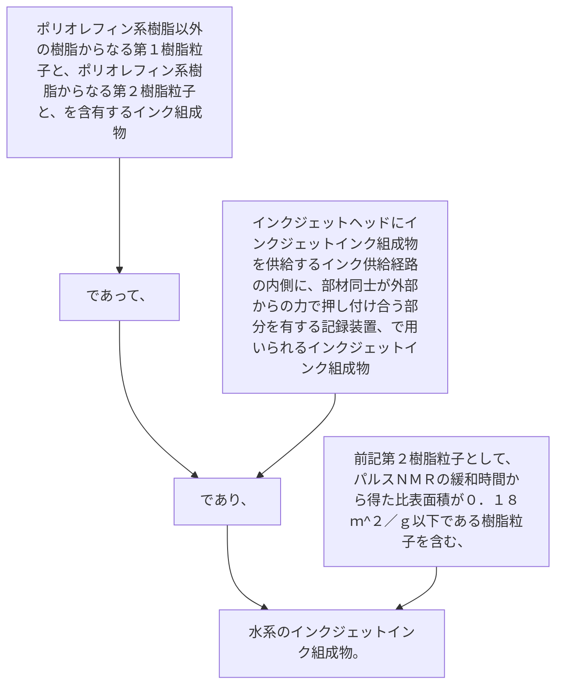

ポリオレフィン系樹脂以外の樹脂からなる第１樹脂粒子と、ポリオレフィン系樹脂からなる第２樹脂粒子と、を含有するインク組成物であって、
インクジェットヘッドにインクジェットインク組成物を供給するインク供給経路の内側に、部材同士が外部からの力で押し付け合う部分を有する記録装置、で用いられるインクジェットインク組成物であり、
前記第２樹脂粒子として、パルスＮＭＲの緩和時間から得た比表面積が０．１８ｍ
^２
／ｇ以下である樹脂粒子を含む、水系のインクジェットインク組成物。
