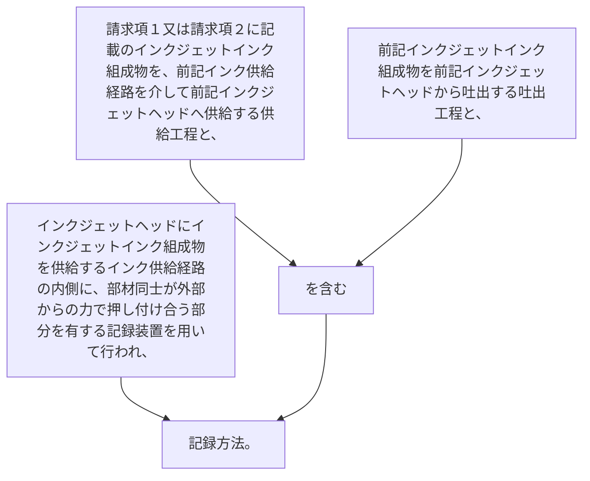

インクジェットヘッドにインクジェットインク組成物を供給するインク供給経路の内側に、部材同士が外部からの力で押し付け合う部分を有する記録装置を用いて行われ、
請求項１又は請求項２に記載のインクジェットインク組成物を、前記インク供給経路を介して前記インクジェットヘッドへ供給する供給工程と、
前記インクジェットインク組成物を前記インクジェットヘッドから吐出する吐出工程と、
を含む記録方法。

```mermaid
flowchart TD
A[インクジェットヘッドにインクジェットインク組成物を供給するインク供給経路の内側に、部材同士が外部からの力で押し付け合う部分を有する記録装置を用いて行われ、]
B[請求項１又は請求項２に記載のインクジェットインク組成物を、前記インク供給経路を介して前記インクジェットヘッドへ供給する供給工程と、]
C[前記インクジェットインク組成物を前記インクジェットヘッドから吐出する吐出工程と、]
D[を含む]
E[記録方法。]
A --> E
B --> D
C --> D
D --> E
```