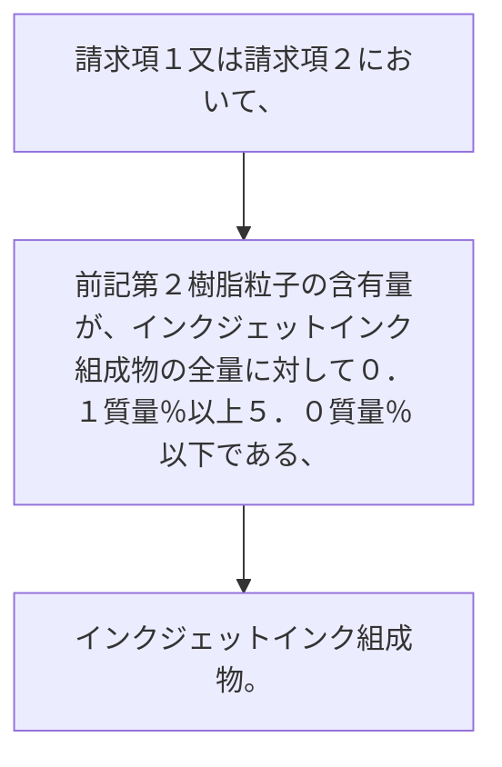

請求項１又は請求項２において、
前記第２樹脂粒子の含有量が、インクジェットインク組成物の全量に対して０．１質量％以上５．０質量％以下である、インクジェットインク組成物。

```mermaid
flowchart TD
A[請求項１又は請求項２において、]
B[前記第２樹脂粒子の含有量が、インクジェットインク組成物の全量に対して０．１質量％以上５．０質量％以下である、]
C[インクジェットインク組成物。]
A --> B
B --> C
```