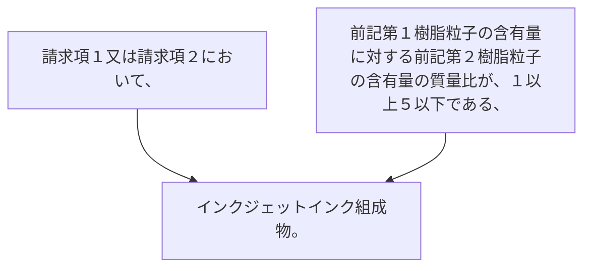

請求項１又は請求項２において、
前記第１樹脂粒子の含有量に対する前記第２樹脂粒子の含有量の質量比が、１以上５以下である、インクジェットインク組成物。

```mermaid
flowchart TD
A[請求項１又は請求項２において、]
B[前記第１樹脂粒子の含有量に対する前記第２樹脂粒子の含有量の質量比が、１以上５以下である、]
C[インクジェットインク組成物。]
A --> C
B --> C
```