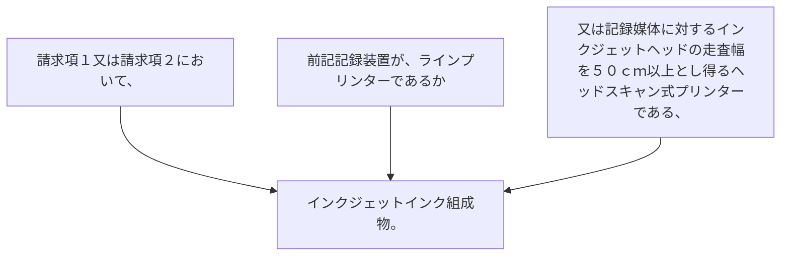

請求項１又は請求項２において、
前記記録装置が、ラインプリンターであるか又は記録媒体に対するインクジェットヘッドの走査幅を５０ｃｍ以上とし得るヘッドスキャン式プリンターである、インクジェットインク組成物。

```mermaid
flowchart TD
A[請求項１又は請求項２において、]
B[前記記録装置が、ラインプリンターであるか]
C[又は記録媒体に対するインクジェットヘッドの走査幅を５０ｃｍ以上とし得るヘッドスキャン式プリンターである、]
D[インクジェットインク組成物。]
A --> D
B --> D
C --> D
```