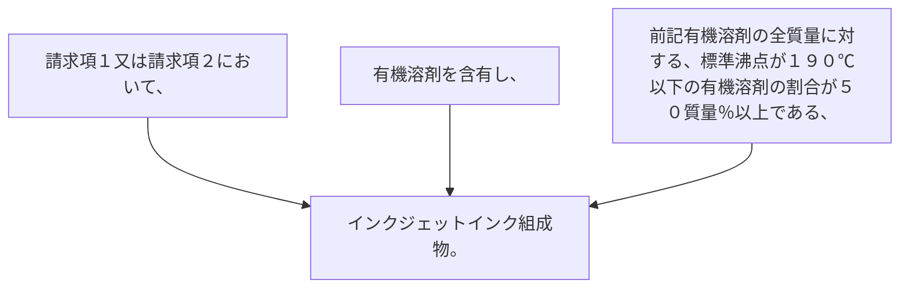

請求項１又は請求項２において、
有機溶剤を含有し、前記有機溶剤の全質量に対する、標準沸点が１９０℃以下の有機溶剤の割合が５０質量％以上である、インクジェットインク組成物。

```mermaid
flowchart TD
A[請求項１又は請求項２において、]
B[有機溶剤を含有し、]
C[前記有機溶剤の全質量に対する、標準沸点が１９０℃以下の有機溶剤の割合が５０質量％以上である、]
D[インクジェットインク組成物。]
A --> D
B --> D
C --> D
```