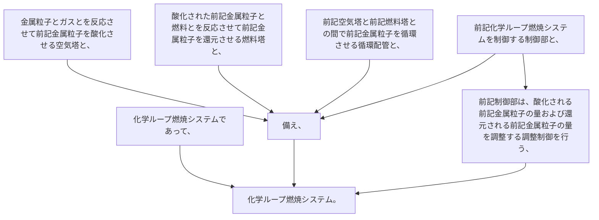

```mermaid
flowchart TD
A[化学ループ燃焼システムであって、]
B[金属粒子とガスとを反応させて前記金属粒子を酸化させる空気塔と、]
C[酸化された前記金属粒子と燃料とを反応させて前記金属粒子を還元させる燃料塔と、]
D[前記空気塔と前記燃料塔との間で前記金属粒子を循環させる循環配管と、]
E[前記化学ループ燃焼システムを制御する制御部と、]
F[備え、]
G[前記制御部は、酸化される前記金属粒子の量および還元される前記金属粒子の量を調整する調整制御を行う、]
H[化学ループ燃焼システム。]
A --> H
B --> F
C --> F
D --> F
E --> F
F --> H
E --> G
G --> H
```