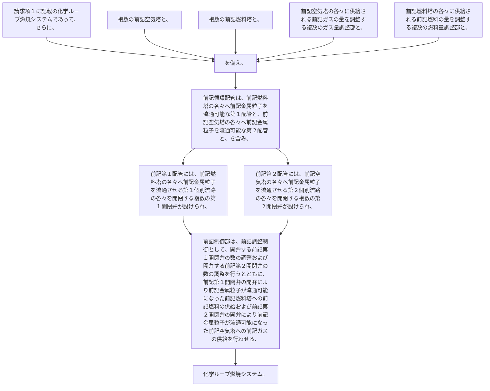

```mermaid
flowchart TD
A[請求項１に記載の化学ループ燃焼システムであって、さらに、]
B[複数の前記空気塔と、]
C[複数の前記燃料塔と、]
D[前記空気塔の各々に供給される前記ガスの量を調整する複数のガス量調整部と、]
E[前記燃料塔の各々に供給される前記燃料の量を調整する複数の燃料量調整部と、]
F[を備え、]
G[前記循環配管は、前記燃料塔の各々へ前記金属粒子を流通可能な第１配管と、前記空気塔の各々へ前記金属粒子を流通可能な第２配管と、を含み、]
H[前記第１配管には、前記燃料塔の各々へ前記金属粒子を流通させる第１個別流路の各々を開閉する複数の第１開閉弁が設けられ、]
I[前記第２配管には、前記空気塔の各々へ前記金属粒子を流通させる第２個別流路の各々を開閉する複数の第２開閉弁が設けられ、]
J[前記制御部は、前記調整制御として、開弁する前記第１開閉弁の数の調整および開弁する前記第２開閉弁の数の調整を行うとともに、前記第１開閉弁の開弁により前記金属粒子が流通可能になった前記燃料塔への前記燃料の供給および前記第２開閉弁の開弁により前記金属粒子が流通可能になった前記空気塔への前記ガスの供給を行わせる、]
K[化学ループ燃焼システム。]

A --> F
B --> F
C --> F
D --> F
E --> F
F --> G
G --> H
G --> I
H --> J
I --> J
J --> K
```