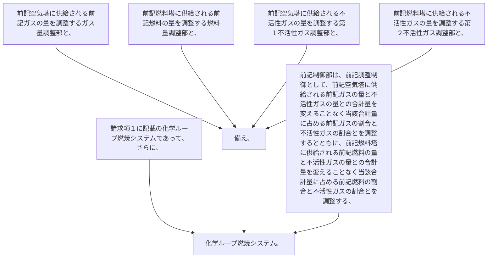

```mermaid
flowchart TD
A[請求項１に記載の化学ループ燃焼システムであって、さらに、]
B[前記空気塔に供給される前記ガスの量を調整するガス量調整部と、]
C[前記燃料塔に供給される前記燃料の量を調整する燃料量調整部と、]
D[前記空気塔に供給される不活性ガスの量を調整する第１不活性ガス調整部と、]
E[前記燃料塔に供給される不活性ガスの量を調整する第２不活性ガス調整部と、]
F[備え、]
G[前記制御部は、前記調整制御として、前記空気塔に供給される前記ガスの量と不活性ガスの量との合計量を変えることなく当該合計量に占める前記ガスの割合と不活性ガスの割合とを調整するとともに、前記燃料塔に供給される前記燃料の量と不活性ガスの量との合計量を変えることなく当該合計量に占める前記燃料の割合と不活性ガスの割合とを調整する、]
H[化学ループ燃焼システム。]
A --> H
B --> F
C --> F
D --> F
E --> F
F --> H
G --> H
```