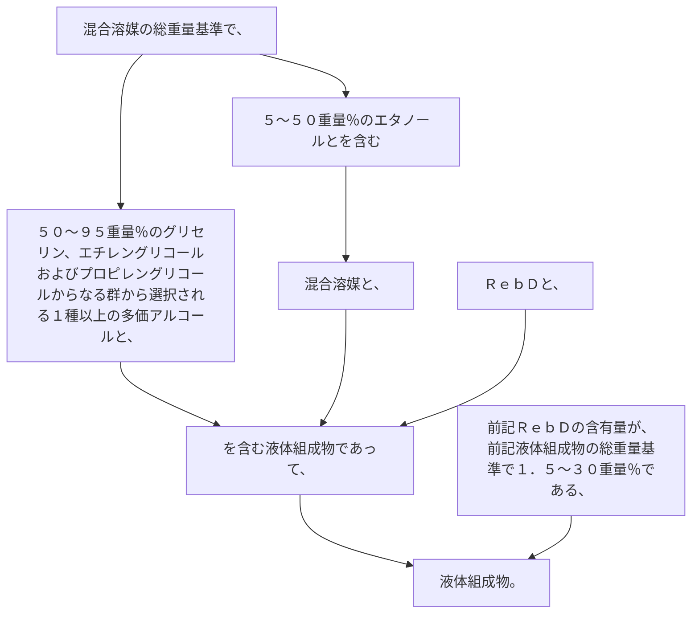

```mermaid
flowchart TD
A[混合溶媒の総重量基準で、]
B[５０～９５重量％のグリセリン、エチレングリコールおよびプロピレングリコールからなる群から選択される１種以上の多価アルコールと、]
C[５～５０重量％のエタノールとを含む]
D[混合溶媒と、]
E[ＲｅｂＤと、]
F[を含む液体組成物であって、]
G[前記ＲｅｂＤの含有量が、前記液体組成物の総重量基準で１．５～３０重量％である、]
H[液体組成物。]
A --> B
A --> C
B --> F
C --> D
D --> F
E --> F
F --> H
G --> H
```