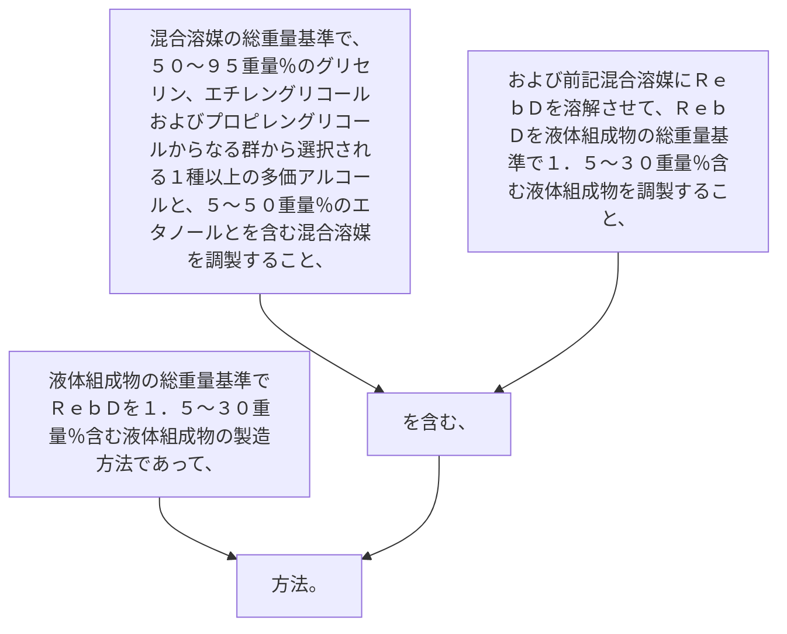

液体組成物の総重量基準でＲｅｂＤを１．５～３０重量％含む液体組成物の製造方法であって、
混合溶媒の総重量基準で、
５０～９５重量％のグリセリン、エチレングリコールおよびプロピレングリコールからなる群から選択される１種以上の多価アルコールと、
５～５０重量％のエタノールとを含む混合溶媒を調製すること、および
前記混合溶媒にＲｅｂＤを溶解させて、ＲｅｂＤを液体組成物の総重量基準で１．５～３０重量％含む液体組成物を調製すること、
を含む、方法。
