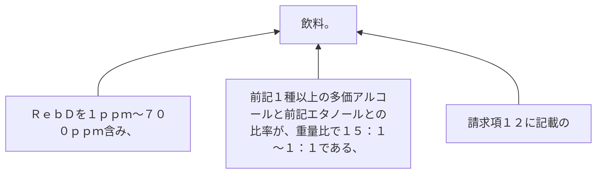

ＲｅｂＤを１ｐｐｍ～７００ｐｐｍ含み、前記１種以上の多価アルコールと前記エタノールとの比率が、重量比で１５：１～１：１である、請求項１２に記載の飲料。

```mermaid
flowchart BT
D[飲料。]
C[請求項１２に記載の]
B[前記１種以上の多価アルコールと前記エタノールとの比率が、重量比で１５：１～１：１である、]
A[ＲｅｂＤを１ｐｐｍ～７００ｐｐｍ含み、]

A --> D
B --> D
C --> D
```