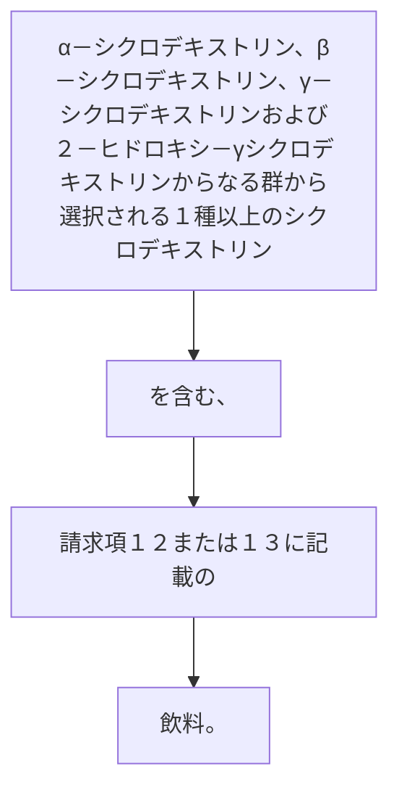

α－シクロデキストリン、β－シクロデキストリン、γ－シクロデキストリンおよび２－ヒドロキシ－γシクロデキストリンからなる群から選択される１種以上のシクロデキストリンを含む、請求項１２または１３に記載の飲料。

```mermaid
flowchart TD
A[α－シクロデキストリン、β－シクロデキストリン、γ－シクロデキストリンおよび２－ヒドロキシ－γシクロデキストリンからなる群から選択される１種以上のシクロデキストリン]
B[を含む、]
C[請求項１２または１３に記載の]
D[飲料。]
A --> B
B --> C
C --> D
```