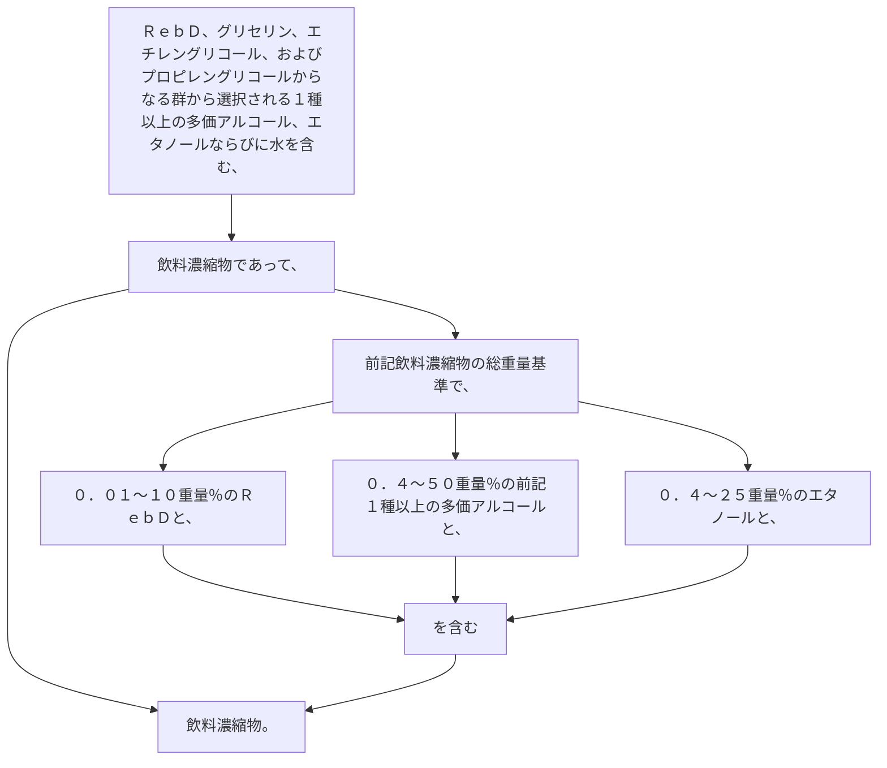

ＲｅｂＤ、グリセリン、エチレングリコール、およびプロピレングリコールからなる群から選択される１種以上の多価アルコール、エタノールならびに水を含む、飲料濃縮物であって、前記飲料濃縮物の総重量基準で、
０．０１～１０重量％のＲｅｂＤと、
０．４～５０重量％の前記１種以上の多価アルコールと、
０．４～２５重量％のエタノールと、を含む飲料濃縮物。

```mermaid
flowchart TD
A[ＲｅｂＤ、グリセリン、エチレングリコール、およびプロピレングリコールからなる群から選択される１種以上の多価アルコール、エタノールならびに水を含む、]
B[飲料濃縮物であって、]
C[前記飲料濃縮物の総重量基準で、]
D[０．０１～１０重量％のＲｅｂＤと、]
E[０．４～５０重量％の前記１種以上の多価アルコールと、]
F[０．４～２５重量％のエタノールと、]
G[を含む]
H[飲料濃縮物。]
A --> B
B --> H
B --> C
C --> D
C --> E
C --> F
D --> G
E --> G
F --> G
G --> H
```