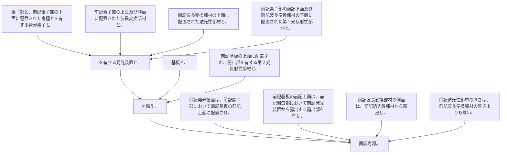

```mermaid
flowchart TD
A[素子部と、前記素子部の下面に配置された電極とを有する発光素子と、]
B[前記素子部の上面及び側面に配置された波長変換部材と、]
C[前記波長変換部材の上面に配置された透光性部材と、]
D[前記素子部の前記下面及び前記波長変換部材の下面に配置された第１光反射性部材と、]
E[を有する発光装置と、]
F[基板と、]
G[前記基板の上面に配置され、開口部を有する第２光反射性部材と、]
H[を備え、]
I[前記発光装置は、前記開口部において前記基板の前記上面に配置され、]
J[前記基板の前記上面は、前記開口部において前記発光装置から露出する露出部を有し、]
K[前記波長変換部材の側面は、前記透光性部材から露出し、]
L[前記透光性部材の厚さは、前記波長変換部材の厚さよりも厚い、]
M[面状光源。]

A --> E
B --> E
C --> E
D --> E

E --> H
F --> H
G --> H

H --> M
I --> M
J --> M
K --> M
L --> M
```