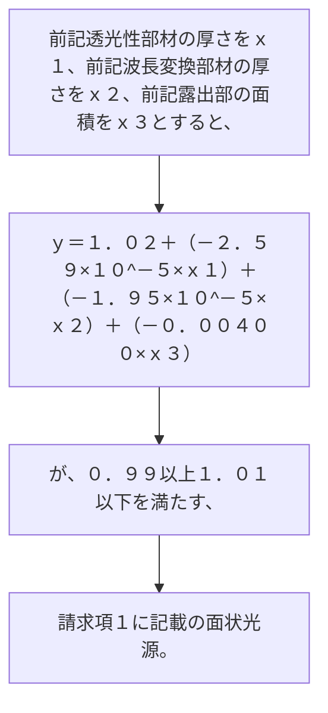

```mermaid
flowchart TD
A[前記透光性部材の厚さをｘ１、前記波長変換部材の厚さをｘ２、前記露出部の面積をｘ３とすると、]
B[ｙ＝１．０２＋（－２．５９×１０^－５×ｘ１）＋（－１．９５×１０^－５×ｘ２）＋（－０．００４００×ｘ３）]
C[が、０．９９以上１．０１以下を満たす、]
D[請求項１に記載の面状光源。]
A --> B
B --> C
C --> D
```