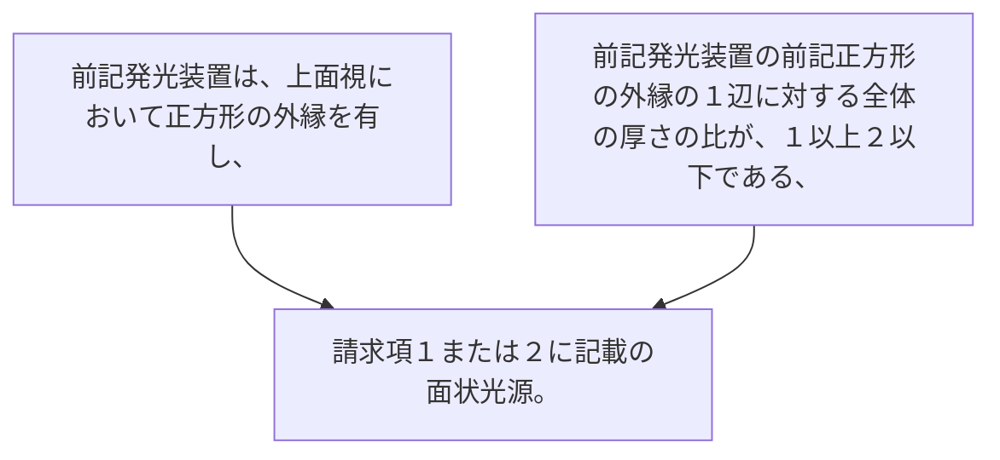

前記発光装置は、上面視において正方形の外縁を有し、
前記発光装置の前記正方形の外縁の１辺に対する全体の厚さの比が、１以上２以下である、請求項１または２に記載の面状光源。

```mermaid
flowchart TD
A[前記発光装置は、上面視において正方形の外縁を有し、]
B[前記発光装置の前記正方形の外縁の１辺に対する全体の厚さの比が、１以上２以下である、]
C[請求項１または２に記載の面状光源。]
A --> C
B --> C
```