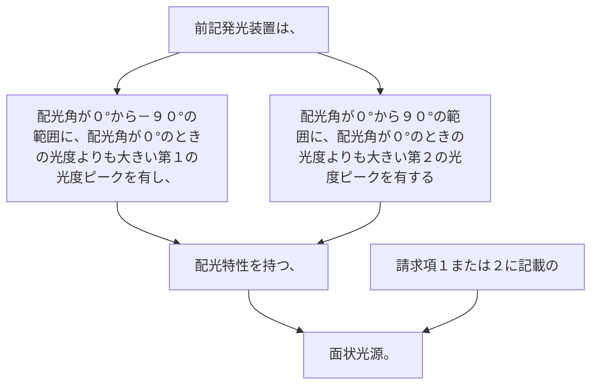

```mermaid
flowchart TD
A[前記発光装置は、]
B[配光角が０°から－９０°の範囲に、配光角が０°のときの光度よりも大きい第１の光度ピークを有し、]
C[配光角が０°から９０°の範囲に、配光角が０°のときの光度よりも大きい第２の光度ピークを有する]
D[配光特性を持つ、]
E[請求項１または２に記載の]
F[面状光源。]
A --> B
A --> C
B --> D
C --> D
D --> F
E --> F
```