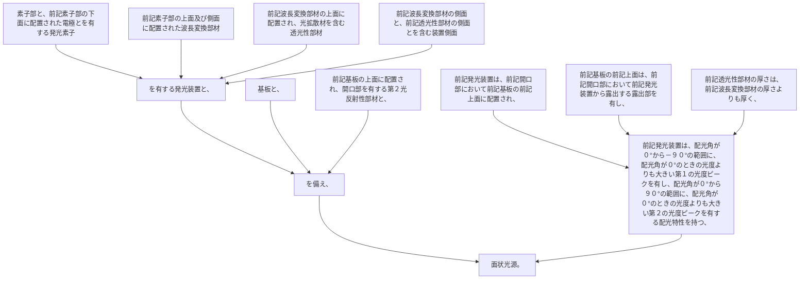

素子部と、前記素子部の下面に配置された電極とを有する発光素子と、前記素子部の上面及び側面に配置された波長変換部材と、前記波長変換部材の上面に配置され、光拡散材を含む透光性部材と、前記波長変換部材の側面と、前記透光性部材の側面とを含む装置側面と、を有する発光装置と、
基板と、
前記基板の上面に配置され、開口部を有する第２光反射性部材と、
を備え、
前記発光装置は、前記開口部において前記基板の前記上面に配置され、
前記基板の前記上面は、前記開口部において前記発光装置から露出する露出部を有し、
前記透光性部材の厚さは、前記波長変換部材の厚さよりも厚く、
前記発光装置は、配光角が０°から－９０°の範囲に、配光角が０°のときの光度よりも大きい第１の光度ピークを有し、配光角が０°から９０°の範囲に、配光角が０°のときの光度よりも大きい第２の光度ピークを有する配光特性を持つ、面状光源。
