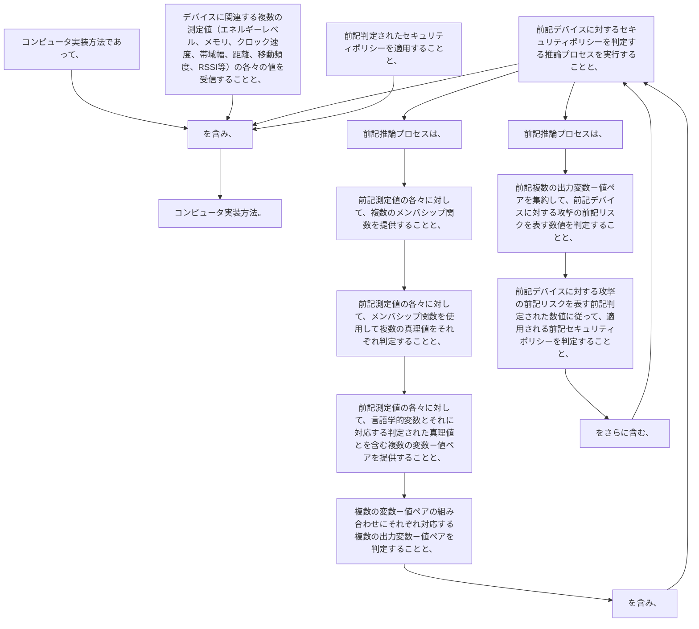

コンピュータ実装方法であって、
デバイスに関連する複数の測定値の各々の値を受信することであって、前記測定値は、
前記デバイス内のバッテリーのエネルギーレベル、
前記デバイス内のプロセッサの利用可能なメモリ、
前記デバイス内のプロセッサのクロック速度、
前記デバイスの通信チャネルの帯域幅、
前記デバイスと、前記デバイスが通信するように構成されている他のデバイスとの間の距離、
前記デバイスの移動頻度、及び
前記デバイスが通信するように構成されている前記他のデバイスからの信号の受信信号強度指標（ＲＳＳＩ）のうちの少なくとも２つを表す、ことと、
前記デバイスに対するセキュリティポリシーを判定する推論プロセスを実行することと、
前記判定されたセキュリティポリシーを適用することと、を含み、
前記推論プロセスは、
前記測定値の各々に対して、複数のメンバシップ関数を提供することであって、前記メンバシップ関数は、それぞれ、前記測定値の値の大きさを記載するための複数の言語学的真理値に対応し、各メンバシップ関数は、前記測定値の値と、前記対応する言語学的変数によって前記測定値の値がどの程度良好に記載されているかを示す真理値との間のマッピングを定義する、ことと、
前記測定値の各々に対して、前記測定値に対して提供された複数のメンバシップ関数を使用して、複数の真理値をそれぞれ判定することと、
前記測定値の各々に対して、各々が前記言語学的変数とそれに対応する判定された真理値とを含む複数の変数－値ペアを提供することと、
複数の変数－値ペアの組み合わせにそれぞれ対応する複数の出力変数－値ペアを判定することと、を含み、
各出力変数－値のペアは、デバイスに対する攻撃のリスクの大きさを記載するための複数のリスク言語学的変数のうちの１つと、リスク真理値とを含み、
各出力変数－値ペアに対して、前記リスク言語学的変数は、前記対応する変数－値ペアの組み合わせの前記言語学的変数に基づき、かつ前記リスク言語学的変数と前記測定値の言語学的変数の組み合わせとの間のマッピングを定義するルールを使用して判定され、
各出力変数－値ペアに対して、前記対応する変数－値ペアの組み合わせの前記真理値に基づいて前記リスク真理値が判定され、
前記推論プロセスは、
前記複数の出力変数－値ペアを集約して、前記デバイスに対する攻撃の前記リスクを表す数値を判定することと、
前記デバイスに対する攻撃の前記リスクを表す前記判定された数値に従って、適用される前記セキュリティポリシーを判定することと、をさらに含む、コンピュータ実装方法。
