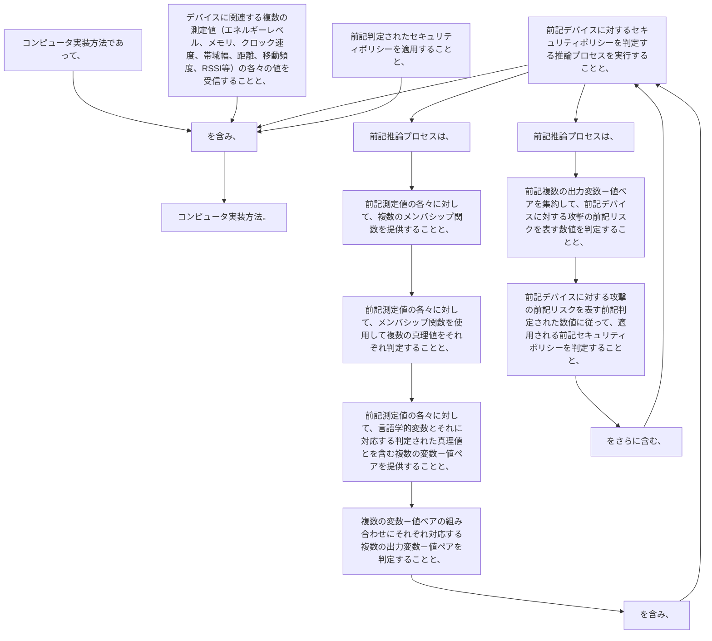

```mermaid
flowchart TD
A[コンピュータ実装方法であって、]
P[コンピュータ実装方法。]

B[デバイスに関連する複数の測定値（エネルギーレベル、メモリ、クロック速度、帯域幅、距離、移動頻度、RSSI等）の各々の値を受信することと、]
C[前記デバイスに対するセキュリティポリシーを判定する推論プロセスを実行することと、]
D[前記判定されたセキュリティポリシーを適用することと、]
E[を含み、]

F[前記推論プロセスは、]
G[前記測定値の各々に対して、複数のメンバシップ関数を提供することと、]
H[前記測定値の各々に対して、メンバシップ関数を使用して複数の真理値をそれぞれ判定することと、]
I[前記測定値の各々に対して、言語学的変数とそれに対応する判定された真理値とを含む複数の変数－値ペアを提供することと、]
J[複数の変数－値ペアの組み合わせにそれぞれ対応する複数の出力変数－値ペアを判定することと、]
K[を含み、]

L[前記推論プロセスは、]
M[前記複数の出力変数－値ペアを集約して、前記デバイスに対する攻撃の前記リスクを表す数値を判定することと、]
N[前記デバイスに対する攻撃の前記リスクを表す前記判定された数値に従って、適用される前記セキュリティポリシーを判定することと、]
O[をさらに含む、]

A --> E
B --> E
C --> E
D --> E
E --> P

C --> F
F --> G
G --> H
H --> I
I --> J
J --> K
K --> C

C --> L
L --> M
M --> N
N --> O
O --> C
```