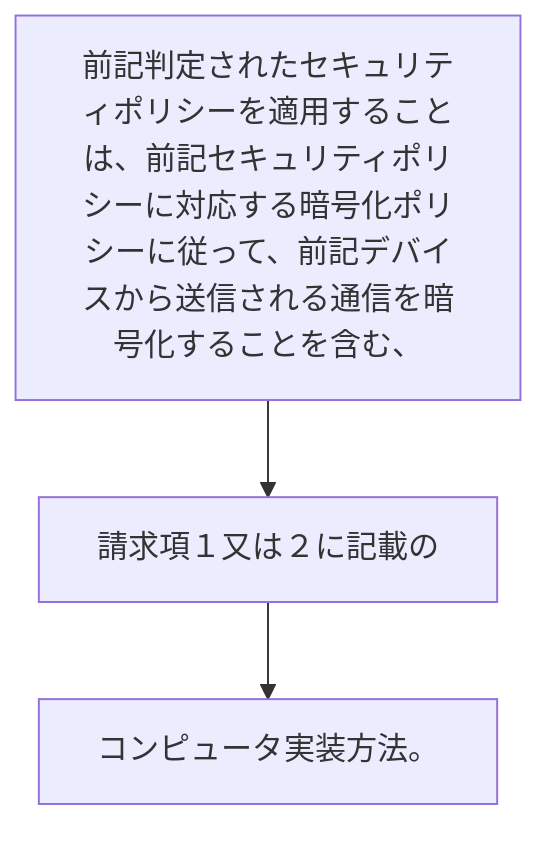

前記判定されたセキュリティポリシーを適用することは、前記セキュリティポリシーに対応する暗号化ポリシーに従って、前記デバイスから送信される通信を暗号化することを含む、請求項１又は２に記載のコンピュータ実装方法。

```mermaid
flowchart TD
A[前記判定されたセキュリティポリシーを適用することは、前記セキュリティポリシーに対応する暗号化ポリシーに従って、前記デバイスから送信される通信を暗号化することを含む、]
B[請求項１又は２に記載の]
C[コンピュータ実装方法。]
A --> B
B --> C
```